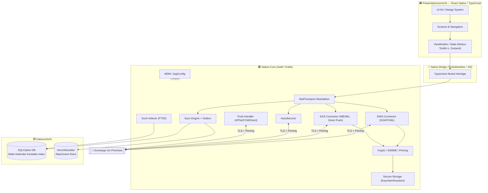
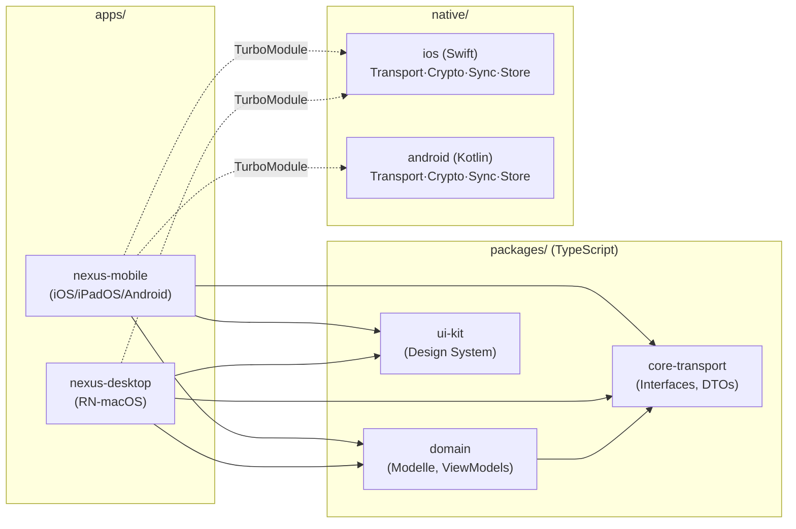
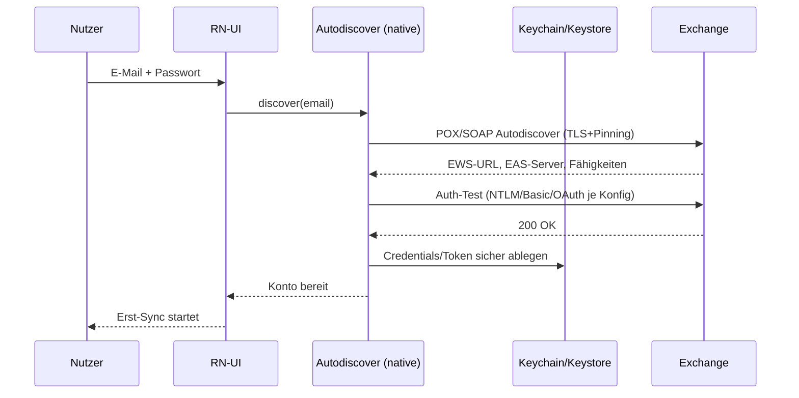
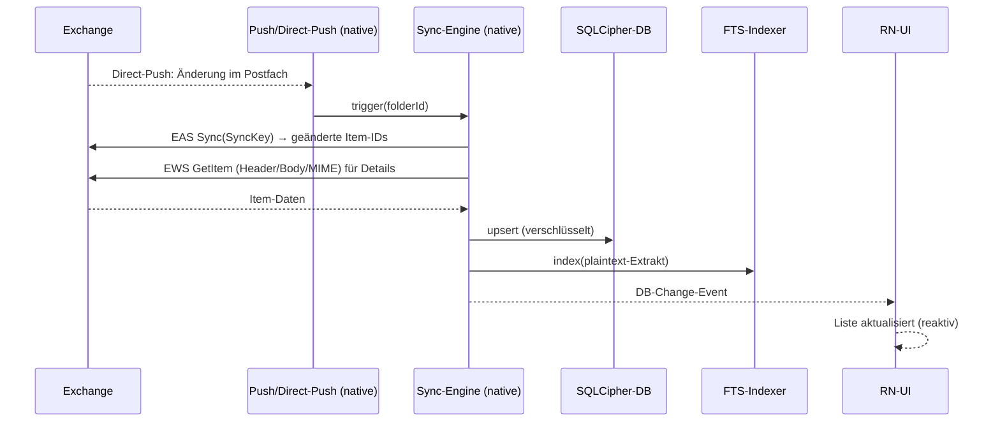
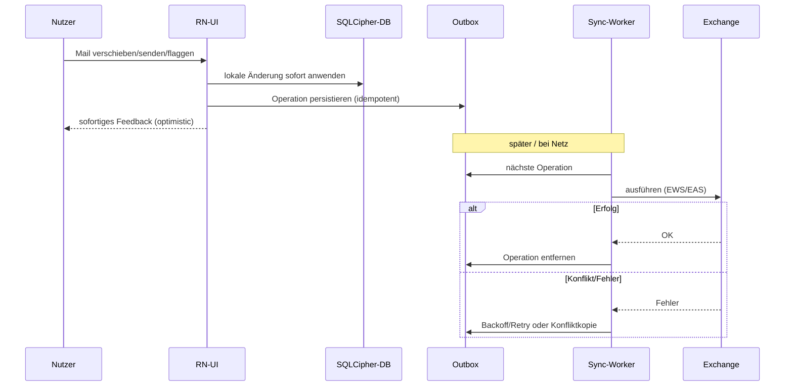
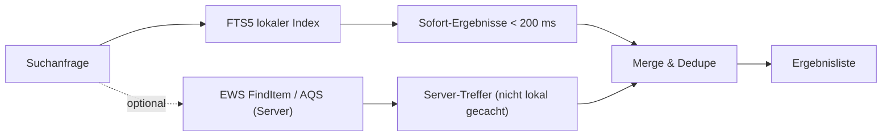

# Phase 3 — Systemarchitektur

> Vollständige Architektur von NEXUS. Grundlage sind die verbindlichen
> [Architektur-Entscheidungen (ADR)](./00-Architektur-Entscheidungen-ADR.md). Leitprinzip:
> **„Thin-JS / Native-Core"** — UI/Orchestrierung in React Native, kritische Pfade nativ.

---

## 1. Architekturziele & -prinzipien

| Ziel | Umsetzung |
|------|-----------|
| **Performance** | Native-Core, Offline-First-DB, FTS5-Suche, kein JS-Bridge im heißen Pfad |
| **Sicherheit** | SQLCipher, Keychain/Keystore, Pinning, S/MIME, Sandbox-Isolation |
| **Offline** | Lokale Wahrheit (DB), Outbox, Delta-Sync, idempotente Operationen |
| **Wartbarkeit** | Schichtentrennung, Transport-Abstraktion, Monorepo, strikte Typen |
| **Skalierbarkeit** | Protokoll-agnostische Transport-Schicht, austauschbare Connectoren |
| **Portabilität** | Geteilte TS-Domäne; plattformspezifische native Module hinter Interfaces |

**Architekturregeln (verbindlich):**
1. Keine Mailinhalte über Dritt-Clouds. Gerät ↔ Exchange direkt.
2. Security-/Krypto-/Protokoll-Logik **nie** in JS.
3. Obere Schichten kennen kein konkretes Protokoll — nur die `MailTransport`-Abstraktion.
4. Jede Server-Operation ist **idempotent** und über die Outbox wiederholbar.
5. Lesen erfolgt **immer** aus der lokalen DB (nie blockierend vom Netz).

---

## 2. Schichtenmodell (System-Architektur)

---

## 3. Moduldiagramm

**Verantwortlichkeiten:**

| Modul | Verantwortung |
|-------|---------------|
| `apps/nexus-mobile` | RN-App-Schale, Plattform-Konfiguration iOS/iPadOS/Android |
| `apps/nexus-desktop` | RN-macOS-Schale (teilt Screens/Domäne) |
| `packages/domain` | Plattformunabhängige Domänenmodelle & ViewModel-Logik |
| `packages/core-transport` | `MailTransport`-Interface, DTOs, EWS/EAS-Typen (TS-Seite) |
| `packages/ui-kit` | Design-System-Komponenten (siehe [Phase 5](./05-UX-und-Design.md)) |
| `native/ios` | Swift-Implementierung aller Native-Core-Fähigkeiten |
| `native/android` | Kotlin-Implementierung aller Native-Core-Fähigkeiten |

---

## 4. Datenflüsse

### 4.1 Autodiscover → Login

### 4.2 Mail-Sync (hybrid EAS-Push + EWS-Detail)

### 4.3 Offline-Aktion → Outbox → Server (Optimistic UI)

### 4.4 Suche (lokal-first, hybrid)

---

## 5. Wichtige Querschnittsthemen

### 5.1 Skalierbarkeit
- **Protokoll-Skalierung:** Transport-Abstraktion erlaubt das Hinzufügen eines
  Graph-Connectors ohne Änderung der oberen Schichten.
- **Datenmengen:** konfigurierbare Sync-Fenster (Zeit/Ordner), Attachment-Lazy-Loading
  mit LRU-Eviction, Paginierung großer Ordner.
- **Mehrkonten:** DB-Schema mit `accountId`-Partitionierung von Beginn an.

### 5.2 Wartbarkeit
- Strikte Schichtengrenzen; Abhängigkeiten zeigen nur „nach unten".
- Geteilte Typen (`core-transport`) verhindern Drift zwischen JS und nativ.
- ADR-getriebene Entscheidungen, dokumentiert und versioniert.

### 5.3 Performance-Budget (Zielwerte)
| Interaktion | Zielwert |
|-------------|----------|
| App-Kaltstart bis Liste | < 1,2 s |
| Öffnen einer Mail (gecacht) | < 100 ms |
| Lokale Suche (erste Treffer) | < 200 ms |
| Scroll Inbox (1000+ Mails) | 60 fps, kein Jank |
| Hintergrund-Sync-Wakeup | akkuschonend, gebündelt |

### 5.4 Fehler-/Resilienz-Strategie
- Exponentielles Backoff für Netz/Sync; idempotente Outbox; klare Offline-Indikatoren.
- Krypto-/Auth-Fehler werden nutzerverständlich gemeldet, nie still verschluckt.

---

## 6. Technologie-Bausteine (Zusammenfassung)

| Belang | Technologie |
|--------|-------------|
| UI-Framework | React Native CLI (+ RN-macOS) |
| Sprache UI | TypeScript (`strict`) |
| State | Redux Toolkit **oder** Zustand (Festlegung in Phase 10) |
| Native | Swift (iOS/macOS), Kotlin (Android) |
| Bridge | TurboModules / JSI |
| DB | SQLite + **SQLCipher** |
| Suche | SQLite **FTS5** |
| Secure-Storage | Keychain (iOS/macOS) / Android Keystore |
| Transport | EWS (SOAP/XML) + EAS (WBXML) + Autodiscover |
| Krypto/S/MIME | native Plattform-Krypto + S/MIME-Bibliotheken |
| Push | APNs / FCM (Weck-Signal) + EAS Direct Push |
| Build/Monorepo | pnpm Workspaces (+ Nx/Turborepo) |

> Detaillierte Sicherheitsarchitektur: siehe [Phase 4 — Security-Konzept](./04-Security-Konzept.md).
