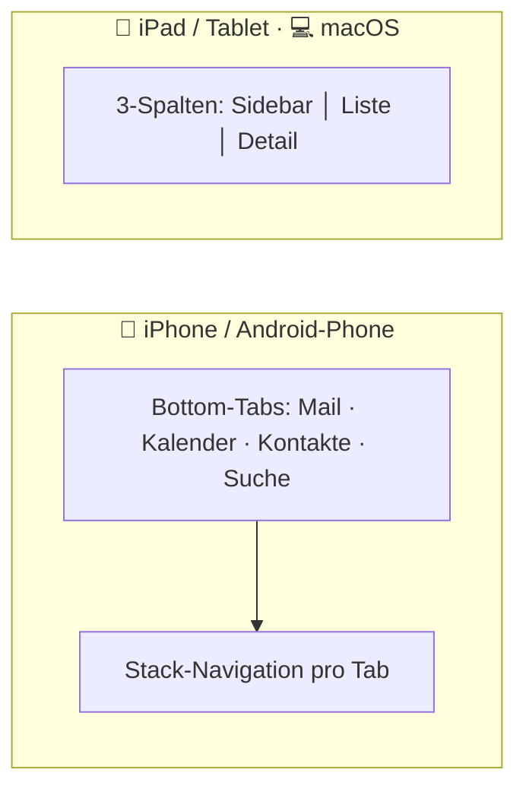
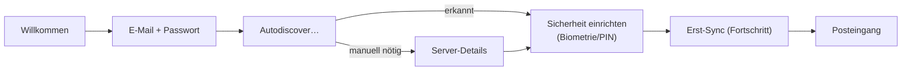
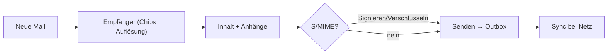

# Phase 5 — UX & Design

> Designprinzipien, Design System, Navigation, Flows und Accessibility für NEXUS.
> Anspruch: **einfach, modern und schnell** — auf vier Plattformen.

---

## 1. Designprinzipien

1. **Klar & plattform-respektierend.** Klar, ruhig, inhaltsfokussiert — aber
   auf jeder Plattform wie ein Bürger der Plattform (HIG auf iOS/macOS, Material auf Android).
2. **Geschwindigkeit ist ein Feature.** Optimistic UI, sofortige Reaktion, keine Spinner
   wo lokale Daten verfügbar sind.
3. **Minimalismus mit Tiefe.** Aufgeräumte Oberfläche; Power-Features (Delegation,
   Shared Mailboxes) sind da, aber nicht im Weg.
4. **Inhalt vor Chrom.** Maximale Lesbarkeit der Mail; UI tritt zurück.
5. **Vertrauen sichtbar machen.** Sicherheitsstatus (S/MIME, Offline, blockierte Bilder)
   klar, ehrlich, nicht alarmistisch.
6. **Konsistenz über Plattformen.** Gleiche mentale Modelle iPhone↔iPad↔Mac↔Android.
7. **Zugänglich für alle.** Accessibility ist Grundanforderung, kein Nachgedanke.

---

## 2. Design System

### 2.1 Design Tokens (Auszug)
Tokens werden zentral in `packages/ui-kit` definiert und plattformübergreifend geteilt.

```
color.brand.primary      = #2563EB   (NEXUS-Blau)
color.brand.primaryDark  = #1D4ED8
color.accent             = #0EA5E9
color.success            = #16A34A
color.warning            = #D97706
color.danger             = #DC2626
color.bg.canvas          = #FFFFFF / dark #0B0F14
color.bg.elevated        = #F7F8FA / dark #131A22
color.text.primary       = #0B0F14 / dark #E6EAF0
color.text.secondary     = #5B6573 / dark #9AA5B1

space.scale  = 4 · 8 · 12 · 16 · 24 · 32 · 48   (4-pt-Grid)
radius        = sm 8 · md 12 · lg 16 · pill 999
elevation     = subtil, schattenarm (flach, modern)
```

### 2.2 Typografie
- **iOS/macOS:** System-Schrift (SF Pro). **Android:** Roboto/System. Dynamische Schriftgrößen
  (Dynamic Type / Font Scaling) durchgängig.
- Hierarchie: `Title` (Postfach), `Headline` (Betreff), `Body` (Inhalt), `Caption` (Meta).

### 2.3 Theming
- **Light/Dark/System** + optionaler **AMOLED-Schwarz**-Modus.
- Hoher Kontrast-Modus (Accessibility).
- Markenakzent dezent; Inhalt dominiert.

---

## 3. Komponentenbibliothek (`packages/ui-kit`)

| Komponente | Zweck |
|------------|-------|
| `MailListRow` | Listenzeile: Absender, Betreff, Snippet, Zeit, Status-Icons, Swipe-Aktionen |
| `MailThread` | Konversationsansicht (gruppierte Nachrichten) |
| `Composer` | Verfassen: Empfänger-Chips, Rich-Text, Anhänge, S/MIME-Toggle |
| `FolderSidebar` | Ordner/Postfächer/Shared-Mailbox-Umschaltung |
| `AccountSwitcher` | Konto-/Delegations-Wechsel |
| `SearchBar` | Sofortsuche mit Scopes/Filtern |
| `SecurityBadge` | S/MIME-/Verschlüsselungs-/Offline-Status |
| `AttachmentChip` | Anhang mit Sicherheits-/Quarantäne-Indikator |
| `EmptyState` / `OfflineBanner` | Zustände klar kommunizieren |
| `CalendarDay/Week/Month` | Kalenderansichten (V1+) |
| `ContactCard` | Kontaktdetails |

Alle Komponenten: themable, accessible, plattform-adaptiv, in Storybook dokumentiert (Phase 10).

---

## 4. Navigationskonzept (plattform-adaptiv)



- **Telefon:** Bottom-Tab-Navigation + Stack; Swipe-Gesten für schnelle Aktionen.
- **Tablet/Desktop:** klassisches **3-Spalten-Layout** (Sidebar · Mailliste · Detail/Composer),
  Tastatur-Shortcuts, Multi-Window (iPad/macOS).
- Gemeinsame Informationsarchitektur, plattformgerechte Darstellung.

---

## 5. Schlüssel-Screen-Flows

### 5.1 Onboarding (Zero-Touch)


### 5.2 Inbox-Triage
- Liste mit dichten, lesbaren Zeilen; **Swipe** links/rechts = konfigurierbare Aktionen
  (Archiv, Löschen, Flag, Verschieben, Snooze).
- Stapelauswahl; sofortige optimistic Reaktion; Offline-Banner wenn ohne Netz.

### 5.3 Verfassen + S/MIME


### 5.4 Delegation / Shared Mailbox
- `AccountSwitcher` zeigt eigenes Postfach + delegierte/freigegebene Postfächer.
- Beim Verfassen klarer „**Senden im Auftrag von …**"-Indikator; keine Identitätsverwirrung.

---

## 6. User Journeys (verknüpft mit Personas)

| Persona | Journey | UX-Schwerpunkt |
|---------|---------|----------------|
| Markus (Power-User) | Offline-Triage im Zug → Sync | Geschwindigkeit, Swipe, Offline-Klarheit |
| Sandra (Delegate) | Vorstands-Postfach verwalten | sauberer Account-Switch, „im Auftrag" |
| Dr. Vogt (Security) | S/MIME-Mail in 2 Taps | Sicherheits-Affordances, Vertrauen |
| Jonas (Admin) | Geräte ausrollen | Zero-Touch-Onboarding, AppConfig |

(Personas: siehe [Produktstrategie](./02-Produktstrategie.md).)

---

## 7. Accessibility (verbindlich)

- **Screenreader:** VoiceOver/TalkBack-Labels für alle interaktiven Elemente.
- **Dynamische Schrift:** vollständige Skalierung ohne Layout-Bruch.
- **Kontrast:** WCAG 2.1 AA als Mindestmaß; High-Contrast-Theme.
- **Motorik:** ausreichend große Trefferflächen (≥ 44 pt), Swipe-Aktionen mit
  Nicht-Gesten-Alternative (Kontextmenü).
- **Reduzierte Bewegung:** Respektieren der „Reduce Motion"-Einstellung.
- **Tastatur:** vollständige Bedienbarkeit auf iPad/macOS/Android mit Tastatur.

---

## 8. Designprozess & Artefakte (Phase 10-Vorbereitung)

- **Figma**-Design-Files als Quelle der Wahrheit; Tokens → Code-Sync.
- **Storybook** für die Komponentenbibliothek.
- Usability-Tests mit echten Exchange-Power-Usern vor V1.
