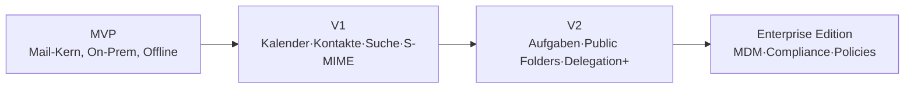

# Phase 6 — Feature-Roadmap

> Entwicklung in klaren Stufen: **MVP → Version 1 → Version 2 → Enterprise Edition**.
> Priorisierung nach **MoSCoW** (Must / Should / Could / Won't-yet). Grundlage:
> [Marktanalyse](./01-Marktanalyse.md), [Strategie](./02-Produktstrategie.md),
> [Feature-Mapping](./07-Outlook-Ersatz-Feature-Mapping.md).

---

## 1. Roadmap-Überblick

| Stufe | Ziel | Primärer Nutzenbeleg |
|-------|------|----------------------|
| **MVP** | Beweisen: schneller, datensouveräner Exchange-Mail-Client | „Es funktioniert offline & ohne Cloud" |
| **V1** | Outlook-Parität in Mail + Kalender/Kontakte/Suche/S-MIME | „Täglich nutzbarer Outlook-Ersatz (Single-User)" |
| **V2** | Enterprise-Funktionstiefe | „Power-User & Delegation/Shared" |
| **Enterprise** | Verwaltbarkeit & Compliance | „IT kann es flottenweit betreiben" |

---

## 2. MVP — Fundament beweisen

**Ziel:** Ein schneller, offline-fähiger Exchange-On-Prem-**Mail**-Client ohne Cloud-Vermittlung.

| Prio | Feature |
|------|---------|
| Must | Autodiscover-Onboarding (E-Mail + Passwort) |
| Must | EAS- **und** EWS-Grundtransport (hybrid, [ADR-002](./00-Architektur-Entscheidungen-ADR.md#adr-002--exchange-transport-ews--eas-hybrid--autodiscover)) |
| Must | Posteingang lesen, Konversationsansicht |
| Must | Senden / Antworten / Weiterleiten |
| Must | Ordner, Verschieben, Löschen, Flaggen, Gelesen-Status |
| Must | Offline-First-DB (SQLCipher) + Outbox |
| Must | Direct-Push / Benachrichtigungen (Weck-Signal) |
| Must | Lokale Verschlüsselung + Keychain/Keystore |
| Must | TLS + Certificate Pinning |
| Must | HTML-Sanitizing + Remote-Content-Block |
| Must | Anhänge anzeigen/senden (quarantänesicher) |
| Should | Lokale Volltextsuche (FTS5, Basis) |
| Should | Light/Dark-Theme, iPhone + Android-Phone |
| Could | iPad-3-Spalten-Layout (Grundgerüst) |

**MVP-Risiken:** EWS/EAS-Hybrid-Komplexität, Autodiscover-Vielfalt realer On-Prem-Setups,
Push/Akku-Tuning. → Mitigation siehe [Risikoanalyse](./09-Risikoanalyse.md).

**Definition of Done (MVP):** Ein Power-User kann seinen Exchange-On-Prem-Account anbinden
und einen Arbeitstag lang Mail produktiv (inkl. offline) nutzen — spürbar schneller als Outlook.

---

## 3. Version 1 — Täglicher Outlook-Ersatz (Single-User)

**Ziel:** Vollständig alltagstauglich; deckt die Kern-Outlook-Funktionen für Einzelnutzer ab.

| Prio | Feature |
|------|---------|
| Must | **Kalender** (Ansicht Tag/Woche/Monat, Termine erstellen/annehmen, Erinnerungen) |
| Must | **Kontakte** (GAL-Suche, lokale Kontakte, Detailkarte) |
| Must | **S/MIME** signieren & verschlüsseln |
| Must | Erweiterte **Suche** (Filter, Scopes, hybrid lokal/Server) |
| Must | Signaturen, Kategorien, Markierungen |
| Must | iPad- & macOS-3-Spalten-Layout vollwertig |
| Should | Snooze, geplantes Senden, Entwürfe-Sync |
| Should | Mehrkonten |
| Should | Out-of-Office (Automatische Antworten) |
| Could | Konversations-Gruppierung „smart", Wischaktionen konfigurierbar |

**DoD (V1):** Ein Einzelnutzer kann Outlook auf seinen Geräten **vollständig ersetzen**
(Mail + Kalender + Kontakte + S/MIME), plattformübergreifend.

---

## 4. Version 2 — Enterprise-Funktionstiefe

**Ziel:** Power-User- und Team-Szenarien — der Differenzierer gegenüber Nine/Apple Mail.

| Prio | Feature |
|------|---------|
| Must | **Delegation** (Stellvertreterzugriff, „Senden im Auftrag") |
| Must | **Shared Mailboxes** |
| Must | **Aufgaben (Tasks)** |
| Should | **Public Folders** |
| Should | **Server-Regeln** anzeigen/bearbeiten |
| Should | **Notizen** |
| Should | Kalender: Terminplanung/Verfügbarkeit, Räume, Einladungen erweitert |
| Could | Archivierung (Online-Archiv-Postfach) |
| Could | Mehr-Kalender-Overlay, geteilte Kalender |

**DoD (V2):** Delegation und Shared Mailboxes funktionieren erstklassig; NEXUS deckt die
Power-User-Workflows ab, an denen mobile Wettbewerber scheitern.

---

## 5. Enterprise Edition — Flottenbetrieb & Compliance

**Ziel:** IT kann NEXUS sicher, verwaltet und compliant flottenweit ausrollen.

| Prio | Feature |
|------|---------|
| Must | **MDM/AppConfig** (Intune, Jamf, Ivanti, Workspace ONE) |
| Must | **Policy-Engine** (Biometrie-Zwang, Open-In-DLP, Copy/Paste-Restriktion, Pinning-Pins) |
| Must | **Remote-Wipe** (MDM + EAS) |
| Should | **Compliance** (Aufbewahrung, eDiscovery-Tauglichkeit, Audit-Log lokal) |
| Should | Jailbreak/Root-Erkennung & -Policy |
| Should | Zentrale Branding-/Konfigurationsvorlagen |
| Could | Self-hosted Management-Konsole für Großkunden |

**DoD (Enterprise):** Eine IT-Abteilung kann NEXUS ohne Nutzerinteraktion ausrollen,
durchsetzen und im Verlustfall sicher löschen.

---

## 6. Won't-yet (bewusst zurückgestellt)

- **Graph-/M365-Cloud-Connector** (als Architektur vorbereitet, [ADR-002](./00-Architektur-Entscheidungen-ADR.md), aber nicht MVP–V2).
- **On-Device-Intelligenz** (Triage/Zusammenfassung) — nur lokal, später.
- **Nicht-Exchange-Protokolle** (IMAP/POP) — strategisch unscharf, vorerst nein.
- **Team-/Chat-Features** — Fokus bleibt Mail/PIM.

---

## 7. Roadmap → Plattform-Matrix

| Feature-Block | iOS | iPadOS | macOS | Android |
|---------------|:---:|:---:|:---:|:---:|
| MVP Mail | ✅ | 🟧 (V1) | 🟧 (V1) | ✅ |
| V1 Kalender/Kontakte/S-MIME | ✅ | ✅ | ✅ | ✅ |
| V2 Delegation/Shared/Tasks | ✅ | ✅ | ✅ | ✅ |
| Enterprise MDM | ✅ | ✅ | ✅ | ✅ |

> Konkrete Epics/Tasks/Sprints zur Umsetzung: siehe [Phase 8 — Entwicklungsplan](./08-Entwicklungsplan.md).
