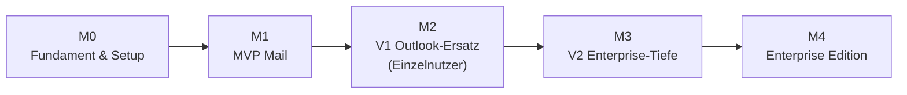

# Phase 8 — Entwicklungsplan

> Von der Roadmap zur Umsetzung: **Epics → Features → Tasks**, Milestones und
> Sprint-Planung. Grundlage: [Roadmap](./06-Feature-Roadmap.md) und
> [Feature-Mapping](./07-Outlook-Ersatz-Feature-Mapping.md). Hinweis: Code wird in
> **Phase 10** geschrieben — dieses Dokument plant den Weg dorthin.

---

## 1. Milestones

| Milestone | Inhalt | Exit-Kriterium |
|-----------|--------|----------------|
| **M0** | Monorepo, Tooling, CI, Native-Bridge-Gerüst, Transport-Abstraktion | App startet, Native-Modul-Roundtrip funktioniert, CI grün |
| **M1** | MVP-Mail (siehe Roadmap) | Power-User nutzt Mail offline + online produktiv |
| **M2** | Kalender, Kontakte, S/MIME, Suche | Outlook-Ersatz für Einzelnutzer |
| **M3** | Delegation, Shared Mailboxes, Tasks, Public Folders | Power-User/Team-Workflows |
| **M4** | MDM, Policies, Remote-Wipe, Compliance | flottenweiter, verwalteter Betrieb |

---

## 2. Epics

| Epic | Beschreibung | Milestone |
|------|--------------|-----------|
| **E0 Plattform-Fundament** | Monorepo, CI/CD, Native-Bridge, Design-System-Skelett | M0 |
| **E1 Transport & Sync** | Autodiscover, EWS-/EAS-Connector, Sync-Engine, Outbox | M0/M1 |
| **E2 Datenschicht & Krypto** | SQLCipher-DB, Secure-Storage, FTS-Index | M0/M1 |
| **E3 Mail-Erlebnis** | Inbox, Thread, Composer, Anhänge, Push | M1 |
| **E4 Kalender** | Ansichten, Termine, RSVP, Verfügbarkeit | M2 |
| **E5 Kontakte** | GAL-Suche, lokale Kontakte, Kontaktkarte | M2 |
| **E6 Security-Features** | S/MIME, Pinning, HTML-Sanitizing, Biometrie-Gate | M1/M2 |
| **E7 Suche** | lokaler FTS-Index + hybride Serversuche | M1/M2 |
| **E8 Enterprise-Collaboration** | Delegation, Shared Mailboxes, Public Folders | M3 |
| **E9 PIM-Erweiterung** | Aufgaben, Notizen, Regeln, Kategorien, Signaturen | M2/M3 |
| **E10 Enterprise-Management** | MDM/AppConfig, Policy-Engine, Remote-Wipe, Compliance | M4 |
| **E11 Plattform-Parität** | iPad-/macOS-3-Spalten, Android-Politur, Accessibility | M2–M4 |

---

## 3. Beispielhafte Feature→Task-Zerlegung

### E1 Transport & Sync (Auszug)

- **F1.1 Autodiscover**
  - T: POX/SOAP-Autodiscover-Client (nativ) implementieren
  - T: Fallback-Reihenfolge (HTTPS-Root → autodiscover-Subdomain → SRV) abbilden
  - T: Fähigkeiten-/Endpunkt-Erkennung (EWS-URL, EAS-Server) parsen
  - T: Auth-Verfahren erkennen/aushandeln (Basic/NTLM/OAuth), Fehlerfälle
- **F1.2 EAS-Connector**
  - T: WBXML-Codec (Encode/Decode)
  - T: `FolderSync`, `Sync` (SyncKey), `Ping`/Direct Push
  - T: Mapping EAS-Item → Domänenmodell
- **F1.3 EWS-Connector**
  - T: SOAP-Client + Auth, `GetItem`/`FindItem`/`SyncFolderItems`
  - T: MIME-Abruf für S/MIME
  - T: Mapping EWS-Item → Domänenmodell
- **F1.4 Sync-Engine & Outbox**
  - T: Delta-Sync-Orchestrierung (EAS-Push → EWS-Detail)
  - T: idempotente Outbox (Senden/Move/Flag/Delete) mit Retry/Backoff
  - T: Konfliktbehandlung + Konfliktkopie

> Analoge Zerlegung für alle Epics erfolgt im Backlog-Tooling (siehe §6).

---

## 4. Sprint-Planung (2-Wochen-Sprints, Vorschlag)

| Sprint | Schwerpunkt | Wesentliche Ergebnisse |
|--------|-------------|------------------------|
| **S0** | Setup | Monorepo, CI, Lint/Format, Native-Bridge-Roundtrip, Design-Tokens |
| **S1** | Transport-Fundament | Autodiscover + Auth, EAS-Codec, EWS-SOAP-Gerüst |
| **S2** | Datenschicht | SQLCipher-DB, Secure-Storage, Domänenmodelle, Outbox-Skelett |
| **S3** | Mail-Read | Sync-Engine (Read-Pfad), Inbox-Liste, Thread-Ansicht |
| **S4** | Mail-Write | Composer, Senden/Antworten, Move/Flag/Delete über Outbox |
| **S5** | Push & Offline | Direct Push, Benachrichtigungen, Offline-Härtung |
| **S6** | Security-Basis | Pinning, HTML-Sanitizing, Remote-Content-Block, Biometrie-Gate |
| **S7** | Suche & MVP-Politur | FTS5-Index, Suche-UI, Performance-Tuning → **MVP-Release** |
| **S8–S11** | V1 | Kalender, Kontakte, S/MIME, erweiterte Suche, iPad/macOS-Layout → **V1** |
| **S12–S15** | V2 | Delegation, Shared Mailboxes, Tasks, Public Folders → **V2** |
| **S16+** | Enterprise | MDM, Policy-Engine, Remote-Wipe, Compliance → **Enterprise Edition** |

> Sprint-Zuschnitt ist ein Planungsvorschlag; tatsächliche Velocity bestimmt die Taktung.

---

## 5. Team-Setup (Empfehlung)

| Rolle | Fokus |
|-------|-------|
| Tech Lead / Architekt | Architektur, Native-Bridge, Reviews |
| 2× Native-Engineer (Swift/Kotlin) | Transport, Krypto, Sync, Secure-Storage |
| 2× RN/TypeScript-Engineer | UI, ViewModels, Navigation, ui-kit |
| 1× QA/Automation | Test-Harness, Geräte-/Exchange-Matrix |
| 1× Product/Design | Flows, Design System, Usability |
| (anteilig) Security-Lead | Threat-Reviews, S/MIME, Pen-Test-Koordination |

> In frühen Sprints können Rollen kombiniert werden; Native-Kompetenz ist der Engpass.

---

## 6. Backlog- & Prozess-Tooling (Phase-10-Vorbereitung)

- **Backlog:** GitHub Issues + Projects (Epics als Meilensteine/Labels, Tasks als Issues).
- **Branching:** Trunk-Based mit kurzlebigen Feature-Branches; PR-Reviews verpflichtend.
- **Definition of Ready / Done:** je Task Akzeptanzkriterien + Test + Security-Checkliste.
- **Test-Exchange-Umgebung:** dedizierte On-Prem-Exchange-Testinstanz (mehrere Versionen)
  für realistische Autodiscover-/Protokoll-Tests.

> CI/CD, Coding-Standards und Teststrategie im Detail: Bestandteil von **Phase 10**.
