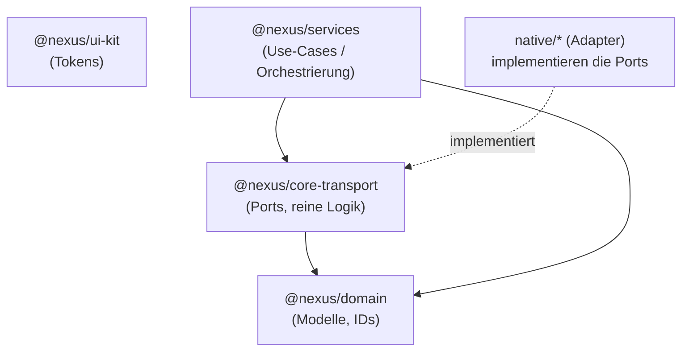
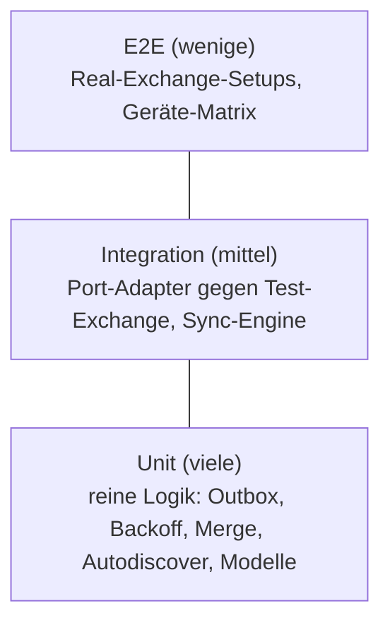

# Phase 10 — Implementierung

> Übergang von Strategie/Architektur (Phasen 1–9) zur Umsetzung: Repository-/Monorepo-
> Struktur, Coding-/TypeScript-Standards, Architekturregeln, CI/CD und Teststrategie.
> Dieses Dokument beschreibt **Stand und Plan** der Implementierung.

---

## 1. Status: Iteration 1 (umgesetzt)

In dieser Umgebung sind nur **plattformunabhängige TypeScript-Pakete** baubar und
verifizierbar (kein Xcode/Swift, kein Android SDK). Deshalb liefert Iteration 1 das
**Monorepo-Fundament + den getesteten TypeScript-Core**; native Module und RN-Apps folgen.

| Bereich | Status |
|---------|--------|
| Monorepo (pnpm Workspaces) + Tooling | ✅ umgesetzt |
| `@nexus/domain` (Modelle, IDs, Helfer) | ✅ umgesetzt + getestet |
| `@nexus/core-transport` (Ports, Fehler, reine Logik) | ✅ umgesetzt + getestet |
| `@nexus/services` (Use-Cases: Mail-/Ordner-Sync, Outbox, Suche, Setup, Kalender, Kontakte, Compose/Delegation) | ✅ umgesetzt + getestet |
| `@nexus/ui-kit` (Design-Tokens) | ✅ umgesetzt + getestet |
| CI/CD (GitHub Actions, TS-Core) | ✅ umgesetzt |
| Native Module (`native/ios`, `native/android`) | ⏳ Folge-Iteration |
| RN-Apps (`apps/nexus-mobile`, `apps/nexus-desktop`) | ⏳ Folge-Iteration |

---

## 2. Repository-/Monorepo-Struktur

```
ITM-Nexus/
├─ packages/
│  ├─ domain/           # @nexus/domain         — Domänenmodelle, branded IDs, reine Helfer
│  ├─ core-transport/   # @nexus/core-transport — Ports, DTOs, Fehler, reine Logik
│  ├─ services/         # @nexus/services       — Use-Cases (Sync, Outbox, Suche, Setup) + In-Memory-Adapter
│  └─ ui-kit/           # @nexus/ui-kit         — Design-Tokens
├─ docs/                # Strategie & Architektur (Phasen 1–10)
├─ .github/workflows/   # CI
├─ tsconfig.base.json   # gemeinsame Compiler-Optionen
├─ tsconfig.json        # Solution-Datei (Project References)
├─ eslint.config.mjs    # Flat-Config inkl. Architektur-Grenzen
├─ vitest.config.ts     # Tests + Coverage (Alias auf Paket-Quellen)
└─ pnpm-workspace.yaml
```

**Geplante Ergänzungen (Folge-Iterationen, vgl. [ADR-006](./00-Architektur-Entscheidungen-ADR.md#adr-006--monorepo-strategie)):**

```
apps/
  nexus-mobile/   # React Native (iOS/iPadOS/Android)
  nexus-desktop/  # React Native macOS
native/
  ios/            # Swift-Module (Transport, Krypto, Sync, SecureStore)
  android/        # Kotlin-Module (analog)
```

- **Paketmanager:** pnpm 10 (in `package.json` via `packageManager` gepinnt).
- **Build-Orchestrierung:** TypeScript **Project References** (`tsc -b`) für korrekte
  Build-Reihenfolge (`domain` → `core-transport`).

---

## 3. Coding- & TypeScript-Standards

- **`strict`** + `noUncheckedIndexedAccess`, `exactOptionalPropertyTypes`,
  `noImplicitOverride`, `noUnusedLocals/Parameters`, `verbatimModuleSyntax`,
  `isolatedModules` (siehe `tsconfig.base.json`).
- **ESLint** `strict-type-checked` + `stylistic-type-checked` (typprüfungsbasiert via
  `projectService`).
- **Konventionen:** keine `any`, keine Non-Null-Assertions in Produktivcode; `enum`s als
  `const`-Objekte + Union-Typen; **branded IDs** für Identitäten; bevorzugt **immutable,
  seiteneffektfreie** Funktionen.
- **Formatierung:** Prettier (Single-Quote, Semikolons, `printWidth` 100, `trailingComma`
  all). Markdown-Docs sind bewusst von Prettier ausgenommen (`.prettierignore`).

---

## 4. Architekturregeln



> `@nexus/services` enthält die **JS-Orchestrierung** (laut „Thin-JS/Native-Core" bewusst
> in TypeScript): `SyncService`, `FolderSyncService`, `OutboxProcessor`, `SearchService`,
> `AccountSetupService`, `CalendarService`, `ContactsService`, `ComposeService`
> (inkl. Delegation/„im Auftrag von"). Sie hängen ausschließlich von den **Ports** ab —
> die nativen Adapter und (später) die React-Native-UI binden dieselben Verträge.
> Integrationstests (`integration.test.ts`) verdrahten den gesamten Stack
> (Setup → Sync → Offline-Triage → Outbox-Drain → Suche; sowie Senden im Auftrag).

1. **Schichtentrennung (per ESLint erzwungen):** `@nexus/domain` darf
   `@nexus/core-transport` und `@nexus/ui-kit` **nicht** importieren. Abhängigkeiten
   zeigen ausschließlich „nach unten".
2. **Ports & Adapter (Hexagonal):** Alle Seiteneffekte (Netzwerk, Krypto, Persistenz,
   Push) stehen hinter **Port-Interfaces** (`MailTransport`, `SecureStore`, `MailStore`,
   `Clock`) in `core-transport`. Die **reine Logik** (Outbox-State-Machine, Backoff,
   Such-Merge, Autodiscover-Auswahl) ist frei von Seiteneffekten und voll testbar.
3. **Thin-JS / Native-Core ([ADR-001](./00-Architektur-Entscheidungen-ADR.md#adr-001--tech-stack-react-native--native-core)):**
   Protokoll-Parser (EWS/EAS) und Krypto liegen in nativen Modulen, die die Ports
   implementieren — **nicht** in TypeScript.

---

## 5. CI/CD-Konzept

- **Aktiv** (`.github/workflows/ci.yml`): auf jeden Push/PR läuft die exakt gleiche Kette
  wie lokal —
  `pnpm install --frozen-lockfile` → `typecheck` → `lint` → `format` → `test:cov` → `build`
  (Node 22, Ubuntu).
- **Ausblick (noch inaktiv, im Workflow dokumentiert):** Native-Build-Matrix —
  iOS/macOS auf `macos-14`-Runnern (Xcode/Swift, RN-Builds + Tests), Android auf
  `ubuntu-latest` (Android SDK, Kotlin-Unit-Tests). Wird aktiviert, sobald `apps/*` und
  `native/*` existieren.
- **Qualitäts-Gate:** PRs müssen die komplette CI grün durchlaufen.

---

## 6. Teststrategie



- **Unit (Schwerpunkt, hier umgesetzt):** reine Logik + Service-Orchestrierung mit
  **Vitest**, deterministisch (injizierte `Clock`/Jitter, In-Memory-Adapter, `FakeMailTransport`).
  Aktueller Stand: **85 Tests** (inkl. End-to-End-Integrationstests), Coverage **> 97 %**
  der Logikpfade. Coverage-Schwellen in `vitest.config.ts` (lines/functions 80, branches 75).
- **Integration (Folge-Iteration):** Port-Adapter (EWS/EAS/SecureStore/MailStore) gegen
  eine dedizierte **On-Prem-Exchange-Testumgebung** (mehrere Server-Versionen).
- **E2E (Folge-Iteration):** kritische Nutzerflüsse über die Geräte-/Plattform-Matrix.
- **Native Unit-Tests:** XCTest (Swift) bzw. JUnit/Kotlin-Test für die nativen Module.

---

## 7. Nächste Iterationen

1. **Native Toolchain & Module:** `native/ios` (Swift) und `native/android` (Kotlin) —
   Autodiscover-Client, EWS-/EAS-Connector, SQLCipher-`MailStore`, `SecureStore`. Sie
   **implementieren die hier definierten Ports**.
2. **`apps/nexus-mobile`** (React Native) — UI/Navigation gegen die TS-Verträge.
3. **`apps/nexus-desktop`** (React Native macOS).
4. **CI-Erweiterung** um die Native-Build-Matrix.
