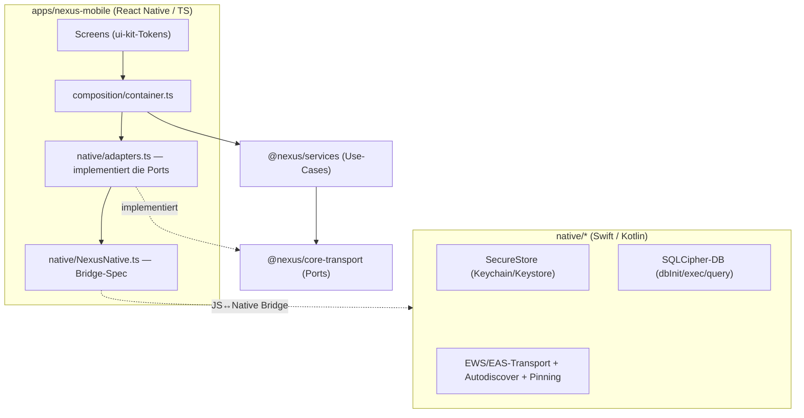

# Phase 10 — Native-Schicht & React-Native-App

> Diese Phase legt die **native Schicht** (Swift/Kotlin) und die **React-Native-App** an,
> die die in den TS-Paketen definierten Ports implementieren bzw. die `@nexus/services`
> konsumieren. Sie setzt das Leitprinzip „Thin-JS / Native-Core"
> ([ADR-001](./00-Architektur-Entscheidungen-ADR.md)) in konkreten Code um.

---

## ⚠️ Verifikations-Status (wichtig)

Diese Schicht ist in der **CI/Linux-Umgebung NICHT baubar oder testbar** — sie benötigt
**Xcode** (iOS/iPadOS/macOS), das **Android SDK/NDK** und die **React-Native-Toolchain**.
Sie ist als **realistisches Gerüst** angelegt: die sicherheitskritischen Teile
(Keychain/Keystore, DB-Schema, Bridge) sind vollständig, die umfangreichen Protokoll-Parser
(EWS-SOAP, EAS-WBXML) werden **iterativ** ergänzt. Die plattformunabhängige TypeScript-Hälfte
(`packages/*`) bleibt davon unberührt und weiterhin vollständig getestet/grün.

---

## Schichten & Verantwortlichkeiten

- **`apps/nexus-mobile/src/native/NexusNative.ts`** — schmale Bridge-Spezifikation des
  nativen Moduls (Secure-Storage, DB-Primitive, Transport). JSON über die Bridge.
- **`.../native/adapters.ts`** — `NativeSecureStore`, `SqlMailStore`, `NativeMailTransport`
  implementieren die Ports aus `@nexus/core-transport` auf Basis der Bridge.
- **`.../composition/container.ts`** — Composition-Root: verdrahtet die Adapter mit den
  `@nexus/services`. Austauschbar gegen die In-Memory-Adapter (Tests/Storybook).
- **`native/ios`, `native/android`** — die nativen Implementierungen (siehe jeweilige READMEs).

## Native-Modul-Oberfläche (Bridge)

| Bereich | Methoden |
|---------|----------|
| Secure-Storage | `secureSet/secureGet/secureDelete/secureWipe` |
| DB (SQLCipher) | `dbInit`, `dbExec(sql, params)`, `dbQuery(sql, params)` |
| Transport (EWS/EAS) | `transportDiscover`, `transportSyncMessages`, `transportApplyOperation`, `transportSendMessage`, `transportSearchServer` |

Die Store-Ports (`MailStore` …) werden in **JS als SQL** über `dbExec/dbQuery` realisiert;
die DB-Verschlüsselung und -Ausführung bleiben nativ. So bleibt die Bridge schmal und die
SQL-/Mapping-Logik plattformunabhängig.

## Status je Baustein

| Baustein | Status |
|----------|--------|
| iOS/Android SecureStore (Keychain/Keystore) | ✅ vollständig |
| DB-Schema (`messages`/`outbox`/FTS5) + Bridge | ✅ vollständig |
| RN-Bridge (Module/Package, Promise-basiert) | ✅ vollständig |
| JS-Adapter (Ports → Bridge) | ✅ vollständig (Messages/Outbox/Transport-Kern) |
| RN-App-Skelett (Navigation, 2 Screens, Container) | ✅ vollständig |
| SQLCipher-Aufrufe aktiv schalten | ⏳ beim Einbinden der Abhängigkeit |
| EWS-SOAP / EAS-WBXML-Parser + Autodiscover-Netzpfad | ⏳ iterativ |
| Certificate-Pinning-Verifikation (Fail-Closed) | ⏳ iterativ |

## Inbetriebnahme (sobald Toolchain vorhanden)

1. `apps/*` in `pnpm-workspace.yaml` aufnehmen → `pnpm install`.
2. iOS: SQLCipher-Pod + Dateien aus `native/ios` ins Xcode-Projekt; `pod install`.
3. Android: Gradle-Abhängigkeiten + Dateien aus `native/android`; `NexusPackage` registrieren.
4. `pnpm --filter @nexus/mobile ios` / `android`.
5. CI um die Native-Build-Matrix erweitern (macOS-Runner für iOS, SDK für Android) —
   vorbereitet als Kommentar in `.github/workflows/ci.yml`.
